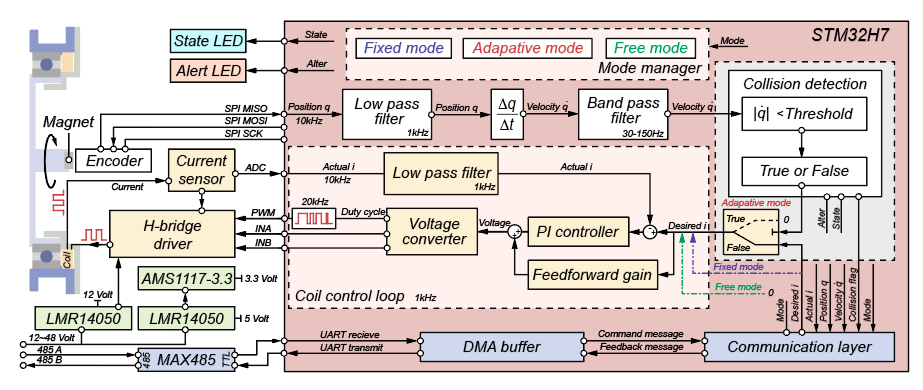

# SafeMRC - STM32H7 Magnetorheological Clutch Controller

## Overview

SafeMRC is an embedded control system for Magnetorheological Clutch (MRC) devices based on STM32H7 microcontrollers. The system provides precise torque, current, and voltage control, real-time collision detection, and robust communication capabilities.



## Hardware Requirements

- safeMRC control board
- MRC device
- Power supply (e.g., 12~48V DC)

## Software Requirements

- MDK-Keil (version 5.0 or newer)
- STM32CubeMX (version 6.2.0 or later)

## Features

- **Precise Torque/Current/Voltage Control**: Supports both voltage and current (feedforward+PI) control modes, with easy switching.
- **Collision Detection**: Real-time collision detection and safety response.
- **DMA UART Communication**: High-efficiency UART communication using DMA and IDLE interrupt.
- **Request-Response Protocol**: Master-slave communication pattern to avoid bus conflicts.
- **Multi-sensor Support**: Encoder feedback, voltage monitoring, and temperature sensing.
- **Safety Features**: Automatic demagnetization on collision detection.
- **Modular Design**: Clean separation of hardware drivers and application logic.
- **Comprehensive Filtering**: Built-in moving average, low-pass, Kalman, and band-pass filters.
- **PWM Nonlinearity Compensation**: Lookup table (LUT) and interpolation for accurate low-voltage output.

## Project Structure

```
safe-MRC/
├── Common/           # Common utilities: filters, PID controllers, etc.
│   ├── Inc/          # Common header files
│   └── Src/          # Common source files
├── Core/             # STM32H7 core files, startup, main, and peripherals
│   ├── Inc/          # Core header files
│   └── Src/          # Core source files (main.c, interrupts, etc.)
├── Device/           # Device drivers and application modules
│   ├── Inc/          # Device/application header files
│   └── Src/          # Device/application source files
├── Drivers/          # STM32H7 HAL drivers (official)
├── MDK-ARM/          # Keil MDK-ARM project files
├── scripts/          # Python host UI, SDK, and data analysis tools
└── ...
```

## 1. Control Modes & Key Logic

### Control Modes


| Enum Name             | Value | Description               |
| ----------------------- | ------- | --------------------------- |
| `MRC_VOLTAGE_CONTROL` | 0     | Voltage control mode      |
| `MRC_CURRENT_CONTROL` | 1     | Coil current control mode |

### Key Reaction Logic

- **KEY1**:
  - Voltage mode: Decrease voltage by 1V per press
  - Current mode: Decrease target current by 0.1A per press
- **KEY2**:
  - Voltage mode: Increase voltage by 1V per press
  - Current mode: Increase target current by 0.1A per press
- **LED1/LED2**: Toggle on key press for feedback.
- **UART**: Prints current set value after each key press.

## 2. Coil Current Control (Feedforward + PI)

- **Function**: `float MRC_CoilCurrentControl_Update(Device_MRC_t *MRC);`
- **Parameters**:
  - `i_ref`: Target current (A)
  - `i_meas`: Measured current (A)
  - `R_coil`: Coil resistance (Ohm, use DC value from multimeter)
  - `L_coil`: Coil inductance (H, use 20kHz value from LCR meter)
  - `Ts`: Sample time (seconds)
- **PI Parameters**: Configured via macros in `drv_mrc.h`:
  - `COIL_PID_KP`, `COIL_PID_KI`, `COIL_PID_KD`, `COIL_PID_TS`, `COIL_PID_MAX_OUT`, `COIL_PID_MIN_OUT`
- **Tuning Advice**: Start with recommended values, increase `Kp` for response, then add `Ki` for zero steady-state error. Reduce `Kp`/`Ki` if overshoot occurs.

## 3. Filters

- **Simple Low-Pass Filter**: `SimpleLowPassFilter` (exponential smoothing, supports cutoff frequency or alpha initialization)
- **Moving Average**: `movingAverage_t` (removes high-frequency noise)
- **First-Order Kalman**: `FirstOrderKalmanFilter` (for noisy signals)
- **Band-Pass**: `BandPassFilter` (extracts specific frequency bands)

**Usage**: See `filter.h` for initialization and update functions. All filters have Doxygen-style comments and are easy to use.

## 4. PWM Target Voltage vs Output Voltage Lookup Table

- **Function**: `float LookupMeasuredVoltageByTarget(float v_target);`
- **How it works**: For |v_target| ≤ 5V, uses LUT and linear interpolation; for |v_target| > 5V, uses v_target directly.
- **Purpose**: Compensates for H-bridge dead-zone and nonlinearity at low voltages.
- **Table Data**: (Current is for reference only; focus on voltage mapping)


| Target Voltage (V) | Measured Voltage (V) | Duty Cycle (0~1) | Output Current (A) |
| -------------------- | ---------------------- | ------------------ | -------------------- |
| 0                  | 0.0017               | 0                | -0.062             |
| 0.1                | 0.0017               | 0.00833          | -0.062             |
| 0.2                | 0.0017               | 0.01667          | 0.062              |
| ...                | ...                  | ...              | ...                |
| 5.0                | 5.752                | 0.41667          | 1.200              |

**Note**: The full table is in code and can be updated as needed.

## 5. Device Structure & Main Interfaces

### Device_MRC_t Main Members


| Member                 | Type/Macro            | Description                        |
| ------------------------ | ----------------------- | ------------------------------------ |
| `state_phase`          | `MRC_State`           | State machine phase                |
| `collision_threshold`  | `float`               | Collision detection threshold      |
| `COLLISION_REACT_FLAG` | `uint8_t`             | Collision reaction flag            |
| `com`                  | `MRC_Com_t`           | Communication structure            |
| `LED1`, `LED2`         | `device_led_t`        | LEDs for feedback                  |
| `KEY1`, `KEY2`         | `device_key_t`        | Keys for user input                |
| `Encoder`              | `Device_encoder_t`    | Encoder feedback                   |
| `VNH7040`              | `Device_VNH7040_t`    | H-bridge driver                    |
| `coil_pid`             | `PID_Controller`      | Coil current PI controller         |
| `coil_current_filter`  | `SimpleLowPassFilter` | Coil current low-pass filter       |
| `control_mode`         | `MRC_ControlMode`     | Control mode (voltage/current)     |
| `statemachine`         | `MRC_StateMachine_t`  | State machine for safety/mode mgmt |
| ...                    | ...                   | ...                                |

**All members and functions are documented in the header files with clear comments.**

## 6. Communication Protocol (Detailed)

### Hardware Interface

- **Physical Layer**: RS-485 differential bus
- **Baudrate**: 4 Mbps (4000000 bps)
- **Topology**: Multi-drop (one master, multiple slaves)
- **Connector**: Standard 485-A/B differential pair
- **Termination**: 120Ω resistors recommended at both ends
- **Cable**: Shielded twisted pair, length < 50m for 4Mbps

### Protocol Overview

- **Pattern**: Request-Response (Master sends command, slave responds)
- **Frame Format**: Binary, fixed length
- **Error Checking**: CRC-16-CCITT (poly=0x1021, init=0xFFFF, no xorout, no reflection)
- **Bus Arbitration**: Only one device transmits at a time (slave only responds after receiving a command)

#### Command Message (Host → Device, 10 bytes)


| Byte Index | Field Name     | Size (bytes) | Description                                     |
| ------------ | ---------------- | -------------- | ------------------------------------------------- |
| 0-1        | Header         | 2            | Frame header, fixed 0xFE, 0xEE                  |
| 2          | Device ID      | 1            | Target device address (0-255)                   |
| 3          | Mode           | 1            | Work mode (see below)                           |
| 4-7        | Target Current | 4            | Desired coil current, int32, little-endian (mA) |
| 8-9        | CRC-16-CCITT   | 2            | CRC of bytes 0-7, little-endian                 |

#### Feedback Message (Device → Host, 17 bytes)


| Byte Index | Field Name       | Size (bytes) | Description                                                 |
| ------------ | ------------------ | -------------- | ------------------------------------------------------------- |
| 0-1        | Header           | 2            | Frame header, fixed 0xFE, 0xEE                              |
| 2          | Device ID        | 1            | Responding device address                                   |
| 3          | Mode             | 1            | Current work mode                                           |
| 4          | Collision Flag   | 1            | 0: safe, 1: collision detected                              |
| 5-8        | Encoder Value    | 4            | Encoder reading, int32, little-endian (deg*1000)            |
| 9-12       | Encoder Velocity | 4            | Encoder angular velocity, int32, little-endian (deg/s*1000) |
| 13-14      | Present Current  | 2            | Current torque, int16, little-endian (mA)                   |
| 15-16      | CRC-16-CCITT     | 2            | CRC of bytes 0-14, little-endian                            |

**Note:** All multi-byte fields use little-endian byte order. CRC is calculated over all bytes except the CRC field itself.

#### CRC-16-CCITT Calculation

- **Polynomial**: 0x1021
- **Initial Value**: 0xFFFF
- **Input/Output Reflection**: None
- **Final XOR**: None
- **Range**: For command, CRC covers bytes 0-7; for feedback, CRC covers bytes 0-14

**Example (C code):**

```c
uint16_t crc_ccitt(uint16_t crc, const uint8_t *data, size_t len);
```

#### Mode Field Definition (MRC_Mode)


| Value | Name       | Description           |
| ------- | ------------ | ----------------------- |
| 0     | FREE       | Free mode (no output) |
| 1     | FIX_LIMIT  | Fixed limit mode      |
| 2     | ADAPTATION | Adaptation mode       |
| 3     | DEBUG      | Debug mode            |

#### Example Communication Sequence

1. The host sends a 10-byte command frame to the RS-485 bus.
2. The target device verifies the ID and CRC, then parses the command.
3. The device replies with a 17-byte feedback frame containing its current status.
4. The host verifies the feedback CRC and reads the status.

#### Physical Layer Notes

- All nodes should use RS-485 transceivers; termination resistors (e.g., 120Ω) are recommended on A/B lines.
- At 4 Mbps, cable length should be limited to several tens of meters, and shielded twisted pair is recommended.
- In case of communication errors, the host should retransmit the command.

## 7. Timer Resource Allocation


| Timer | Purpose/Function                       | Channel(s) | Notes/Details                                     |
| ------- | ---------------------------------------- | ------------ | --------------------------------------------------- |
| TIM1  | Encoder PWM capture (input capture)    | CH4        | Used for reading encoder PWM signal               |
| TIM2  | PWM generation for VNH7040 driver      | CH1        | Main PWM output for motor driver                  |
| TIM3  | (Available/Reserved for PWM)           | CH1, CH2   | Initialized for PWM, not actively used            |
| TIM4  | (Available/Reserved for base timing)   | -          | Initialized, not actively used                    |
| TIM6  | System periodic tasks (key scan, loop) | -          | Periodic interrupt for keyscan, control loop flag |
| TIM7  | (Available/Reserved for base timing)   | -          | Initialized, not actively used                    |

## Example: Main Loop Usage

```c
Device_MRC_t mrc_device;
MRC_Init("MRC_Device", &mrc_device, 0x01);

while(1) {
    MRC_Com_Process(&mrc_device); // Handle communication
    MRC_Key1_Reaction(&mrc_device); // Handle key1
    MRC_Key2_Reaction(&mrc_device); // Handle key2
    if (mrc_device.control_mode == MRC_CURRENT_CONTROL) {
        float i_meas = MRC_Update_Coil_Current(&mrc_device);
        float v_cmd = MRC_CoilCurrentControl_Update(&mrc_device);
        // v_cmd is sent to PWM driver automatically
    } else {
        MRC_set_voltage(&mrc_device);
    }
}
```

## Reflection & Suggestions

- **Documentation Sync**: Always update README after code changes, especially for LUT, parameters, interfaces, and communication protocol (e.g., feedback structure changes, SPI read method changes, etc.).
- **Configurable Parameters**: Consider making PI parameters and LUT updatable via communication protocol in the future.
- **Comments & Examples**: Keep Doxygen-style comments and provide simple usage examples for beginners.
- **SPI Encoder Support**: Consider supporting more types of SPI encoders in the future and keep documentation up to date.

---

**If you have any questions or need further help, just ask!**

## Building and Flashing

### Prerequisites

- Keil MDK-ARM v5.37 or later
- STM32H7xx HAL drivers
- STM32CubeMX (for configuration)

### Build Steps

1. Open `MDK-ARM/safeMRC.uvprojx` in Keil MDK-ARM
2. Configure target settings if needed
3. Build the project (F7)
4. Flash to STM32H7 device

### Configuration

The system can be configured through the following defines:

```c
#define MRC_COIL_MAX_VOLTAGE 12.0f    // Maximum coil voltage
#define PWM_FREQ 20000                // PWM frequency
#define ENCODER_RESOLUTION 4096       // Encoder pulses per revolution
```

## API Reference

### MRC Device Functions

#### `MRC_Init(dev_name, mrc, id)`

Initialize MRC device with communication support.

**Parameters:**

- `dev_name`: Device name string
- `mrc`: MRC device structure pointer
- `id`: Device ID (0-255)

#### `MRC_set_voltage(mrc)`

Set coil voltage based on target value.

**Parameters:**

- `mrc`: MRC device structure pointer

#### `MRC_Com_Process(mrc)`

Handle communication exchange using request-response pattern.

**Parameters:**

- `mrc`: MRC device structure pointer

#### `MRC_collision_detect(mrc)`

Detect collision for the MRC device.

**Parameters:**

- `mrc`: MRC device structure pointer

### Communication Functions

#### `MRC_Com_Init(mrc_com, huart, id)`

Initialize communication module with DMA idle reception support.

#### `MRC_Com_UnpackCmd(mrc_com)`

Unpack and validate command from DMA buffer (device side).

#### `MRC_Com_PackFbk(mrc_com, mode, encoder, velocity, current, collision)`

Pack feedback message with current device status (device side).

#### `MRC_Com_SendFbk(mrc_com)`

Send feedback response using DMA (device side).

#### `MRC_Com_Reset(mrc_com)`

Reset communication status and restart DMA reception (device side).

## Safety Features

1. **Automatic Demagnetization**: On collision detection, coils are automatically demagnetized
2. **Voltage Limiting**: Coil voltage is limited to safe operating range
3. **CRC Validation**: All communication messages are validated using CRC-16
4. **Timeout Protection**: DMA operations include timeout protection
5. **Error Recovery**: Automatic recovery from communication errors
6. **Bus Conflict Prevention**: Request-response pattern prevents multiple devices from transmitting simultaneously

## Troubleshooting

### Common Issues

1. **Communication Not Working**
   - Check UART configuration in STM32CubeMX
   - Verify DMA settings for USART2
   - Ensure IDLE interrupt is enabled
   - Confirm request-response timing
2. **CRC Errors**
   - Verify protocol implementation on host side
   - Check byte order and data types
   - Ensure consistent CRC calculation
3. **DMA Issues**
   - Verify DMA stream configuration
   - Check interrupt priorities
   - Ensure proper buffer alignment
4. **Bus Conflicts**
   - Ensure only one device responds at a time
   - Check device ID configuration
   - Verify request-response timing

### Debug Output

The system provides debug output through UART1:

- Device initialization status
- Communication errors
- Collision detection events
- Voltage/current changes
- Debug CLI commands (including device ID query/change)

## License

This project is licensed under the MIT License - see the LICENSE file for details.

## Contributing

1. Fork the repository
2. Create a feature branch
3. Make your changes
4. Add tests if applicable
5. Submit a pull request

## Support

For technical support or questions, please open an issue on the project repository.

## 8. Host UI & Python SDK (PC Tool)

A cross-platform Python GUI tool and SDK are provided in the `scripts/` directory for real-time communication, control, and data visualization with the SafeMRC embedded controller.

### Main Features

- Serial port auto-detection and high-speed communication (up to 4 Mbps)
- Control panel for mode, frequency, current, and device ID
- Real-time display of all feedback fields (angle, velocity, current, mode, collision flag, CRC, etc.)
- Three-channel real-time plotting (angle, velocity, current) with adjustable time window
- Data recording, export to CSV, and time axis reset
- Robust multithreading for smooth UI experience
- Hexadecimal TX/RX message display for protocol debugging
- Python SDK for scripting and automation

### How to Use

1. Install dependencies and launch the UI as described in `scripts/README.md`.
2. Select the correct serial port and connect.
3. Set control parameters and device ID as needed.
4. Start/stop data recording, export CSV, and clear plots as required.

### Data Export & Analysis

- All feedback data (with high-precision timestamps) can be exported as CSV for offline analysis.
- Time axis in exported data matches the UI plots for easy comparison.

### Protocol Consistency

- The host UI, SDK, and embedded firmware use **identical communication protocols and CRC algorithms**.
- Any protocol changes must be updated in both the embedded code and the UI tool to ensure compatibility.

### Debugging & Troubleshooting

- If the UI cannot connect, check serial port permissions, cable quality, and device power.
- For high-speed operation, use a reliable USB-to-serial adapter.
- If protocol errors occur, verify that both sides use the same baud rate, frame format, and CRC settings.
- For further details, see the troubleshooting section in `scripts/README.md`.

### Example: Python SDK Usage

```python
from safeMRC_sdk import SafeMRC, SafeMRCCmd, SafeMRCData
import time

safe_mrc = SafeMRC('/dev/ttyUSB1')
cmd = SafeMRCCmd(mode=1, current=0.5)
fbk = SafeMRCData()

if safe_mrc.sendRecv(cmd, fbk):
    print(f"Feedback: id={fbk.id}, mode={fbk.mode}, collision={fbk.collision}, "
          f"encoder={fbk.encoder:.5f}, velocity={fbk.velocity:.5f}, current={fbk.current:.5f}")
else:
    print("No valid response or CRC error.")
```

## 9. USART1 Debug CLI Commands

The firmware exposes a lightweight CLI on USART1 (DMA + IDLE) for development and testing. Enable DEBUG work mode first:

- Enable DEBUG mode: `DEBUG ON`
- Disable DEBUG mode: `DEBUG OFF`

Once in DEBUG mode, the following commands are supported:

- Control mode:
  - `MODE VOLTAGE` — switch to voltage control
  - `MODE CURRENT` — switch to current control

- Set targets (with safety ranges):
  - `SET VOLTAGE <value>` — range [-12.0, 12.0] V
  - `SET CURRENT <value>` — range [-5.0, 5.0] A

- Device ID management:
  - `ID CHECK` — print current device ID
  - `ID CHANGE <n>` — set device ID to a natural number in [0, 15]

- Coil resistance management:
  - `RES CHECK` — print current coil resistance (Ohm)
  - `RES CHANGE <ohm>` — set coil resistance (range 0.01 ~ 10.0 Ohm) and persist

Notes:
- If an invalid command or out-of-range parameter is provided, the CLI prints a clear hint.
- Changing ID updates both the communication address (`mrc->com.id`) and the feedback packet ID immediately.
- Linux-style help: `-h` or `--help` prints a concise help menu with all commands.

### Persistent Parameters in Flash

- MCU: STM32H723xG (1MB Flash, 128KB sectors, single bank)
- Flash layout used for persistence:
  - `FLASH_ID_ADDRESS = 0x080E0000` (last sector) — stores device ID (1 byte)
  - `FLASH_RES_ADDRESS = 0x080C0000` (second-to-last sector) — stores coil resistance (`float`, 4 bytes)

Both parameters are saved with sector erase + 32-byte flashword programming, without overlapping sectors to avoid unintended erasures.

### First Boot vs Later Resets

- On first boot (after programming), the resistance address is in erased state (0xFF...). Firmware detects this and:
  - Loads a default resistance (e.g., 4.22 Ohm), then writes it to `FLASH_RES_ADDRESS` for future boots
- On later resets, firmware reads resistance from flash and validates range; if invalid, it falls back to default and rewrites flash.
- When using `ID CHANGE` or `RES CHANGE`, the new value is immediately persisted to the corresponding flash address.

---

**If you have any questions or need further help, just ask!**
