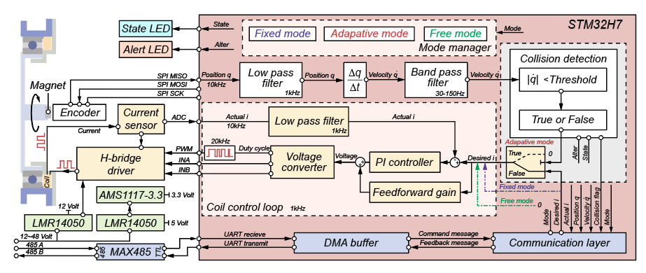

# SafeMRC

**[English](README.md)** | **[中文](README_CN.md)**

> Embedded controller firmware for Magnetorheological Fluid (MRF) clutch / bearing lock devices, built on STM32H7.

[](LICENSE)


<p align="center">
  
</p>

## Features

- **Dual Control Modes** - Voltage control and coil current control (feedforward + PI) with smooth switching
- **Real-Time Collision Detection** - Automatic demagnetization on collision for safety
- **Dual Communication Backend** - RS-485 (4 Mbps) and Classic CAN (1 Mbps), selectable at compile-time
- **State Machine** - FREE / FIX_LIMIT / ADAPTATION / DEBUG modes with safe transitions
- **PWM Nonlinearity Compensation** - LUT + interpolation for accurate low-voltage H-bridge output
- **Comprehensive Filtering** - Moving average, low-pass, Kalman, and band-pass filters
- **Flash Persistence** - Device ID and coil resistance survive power cycles
- **Debug CLI** - Interactive UART1 shell for testing and calibration
- **Python Host Tool** - Cross-platform GUI with real-time plotting and data export

## Quick Start

### Prerequisites

- [Keil MDK-ARM](https://www.keil.com/) v5.37+
- [STM32CubeMX](https://www.st.com/en/development-tools/stm32cubemx.html) (for peripheral config)
- ST-Link programmer

### Build & Flash

```bash
# 1. Open project in Keil
MDK-ARM/safeMRC_for_DM_firmware.uvprojx

# 2. Build (F7 in Keil)
# 3. Flash via ST-Link (Download button or STM32CubeProgrammer)
```

### Host Python Tool

```bash
conda env create -f scripts/environment.yml
conda activate safemrc_host
python scripts/main.py
```

Requires a USB-RS485 adapter at up to 4 Mbps. See [scripts/README.md](scripts/README.md) for details.

### Python SDK Quick Example

```python
from safeMRC_sdk import SafeMRC, SafeMRCCmd, SafeMRCData

mrc = SafeMRC('/dev/ttyUSB0')
cmd = SafeMRCCmd(mode=1, current=0.5)
fbk = SafeMRCData()

if mrc.sendRecv(cmd, fbk):
    print(f"angle={fbk.encoder:.3f}, current={fbk.current:.3f}")
```

## Architecture

```
Core/           HAL-generated peripheral init (CubeMX output)
Common/         Reusable utilities: PID, filters, flash, sys_clock
Devices/        MRC application drivers (primary logic layer)
Applications/   Callbacks wiring HAL interrupts to device logic
scripts/        PC-side Python UI + SDK
```

**Timing:** TIM6 @ 1 kHz drives the state machine and feedback TX. TIM4 @ 10 kHz drives the coil current control loop and communication processing.

**Single global instance:** All application code operates on one `Device_MRC_t MRC` declared in `main.c`. No RTOS - concurrency is managed via ISR-set flags polled in the main loop.

## Communication

Two backends are available, selected at compile-time via `Devices/Inc/mrc_com_backend.h`:

| Backend | Bus | Baudrate | Frame Size | Error Check |
|---------|-----|----------|------------|-------------|
| RS-485  | USART2 | 4 Mbps | CMD: 10 B, FBK: 17 B | CRC-16-CCITT |
| CAN     | FDCAN1 | 1 Mbps | CMD: 8 B, FBK: 8 B | Hardware CRC |

Both use a request-response pattern: host sends a command, device replies with feedback containing encoder position, velocity, current, and collision status.

## Documentation

| Document | Description |
|----------|-------------|
| [RS-485 Protocol](docs/protocol-rs485.md) | Frame format, byte layout, CRC, mode definitions |
| [CAN Protocol](docs/CAN_Protocol_Handoff.md) | CAN ID scheme, frame layout, SocketCAN examples |
| [API Reference](docs/api-reference.md) | Device struct, control functions, filters, timers |
| [Debug CLI & Flash](docs/debug-cli.md) | UART1 CLI commands, flash persistence |
| [Troubleshooting](docs/troubleshooting.md) | Common issues, safety features, debug output |
| [Python Host Tool](scripts/README.md) | GUI setup, SDK usage, data export |

## Contributing

1. Fork the repository
2. Create a feature branch (`git checkout -b feature/my-feature`)
3. Commit your changes (`git commit -am 'Add my feature'`)
4. Push to the branch (`git push origin feature/my-feature`)
5. Open a Pull Request

## License

This project is licensed under the [MIT License](LICENSE).

## Acknowledgments

Developed at the University of Science and Technology of China (USTC).
